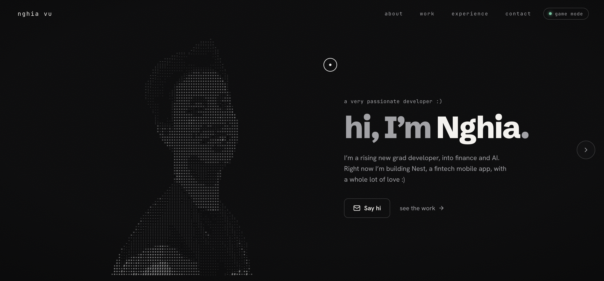

# Nghia Vu — Portfolio

A cinematic, monochrome personal portfolio built with **Astro** and **React 19**. It leans on `framer-motion` for motion, a canvas-rendered **ASCII portrait**, and a hidden **game mode** where a pixel cat roams across the real page.



## ✨ features

- Section-switching layout, not an endless scroll — **About · Work · Experience · Contact**
- Interactive **ASCII portrait** on canvas, with a jelly cursor-repel effect
- Project case pages with adaptive device frames (phone / browser / Vision Pro), a lightbox, and hover previews
- **Sandbox game mode**: a pixel-cat platformer overlaid on the live content — the page stays scrollable and clickable
- Static-first: React only where it needs to be interactive, so first paint stays fast

## 🛠 set-up

Install the dependencies

```bash
npm install
```

Start the development server

```bash
npm run dev
```

## 🚀 build for production

Generate a full static build (outputs to `dist/`)

```bash
npm run build
```

## 🎨 color codes

| Color | Hex |
|---|---|
| Ink (background) | `#0a0a0b` |
| Raised surface | `#141416` |
| Text | `#f4f2ee` |
| Muted | `#a2a2a6` |
| Faint | `#63636a` |
| Accent (mint) | `#6ff2c0` |

## 🔤 type

Schibsted Grotesk (display) · Instrument Serif (accents) · Hanken Grotesk (body) · JetBrains Mono (labels & code)

---

Built with a whole lot of love by **Nghia Vu**. :)
